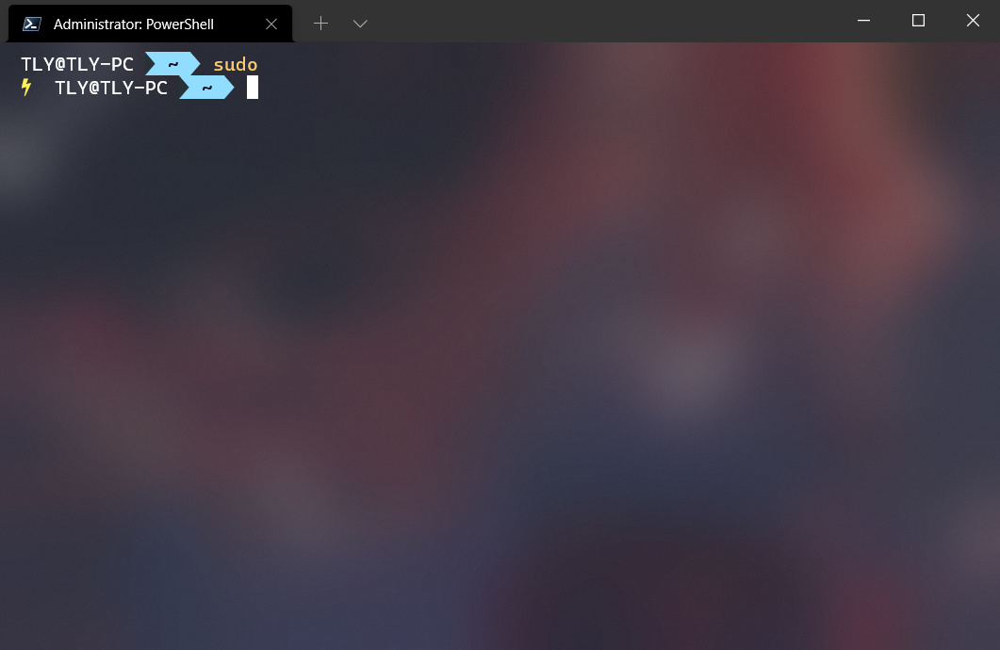
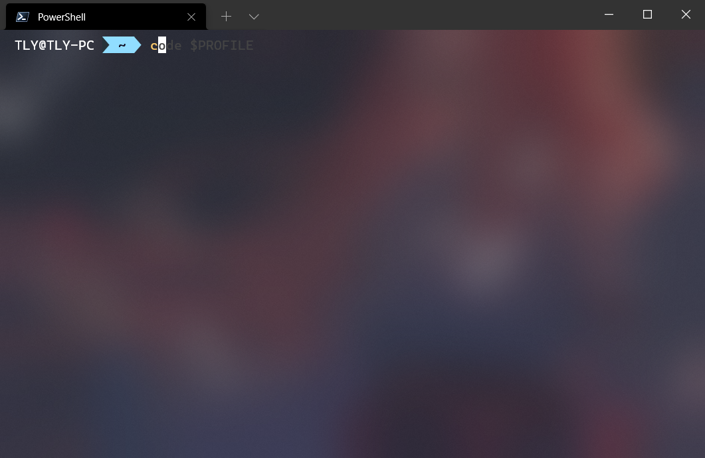
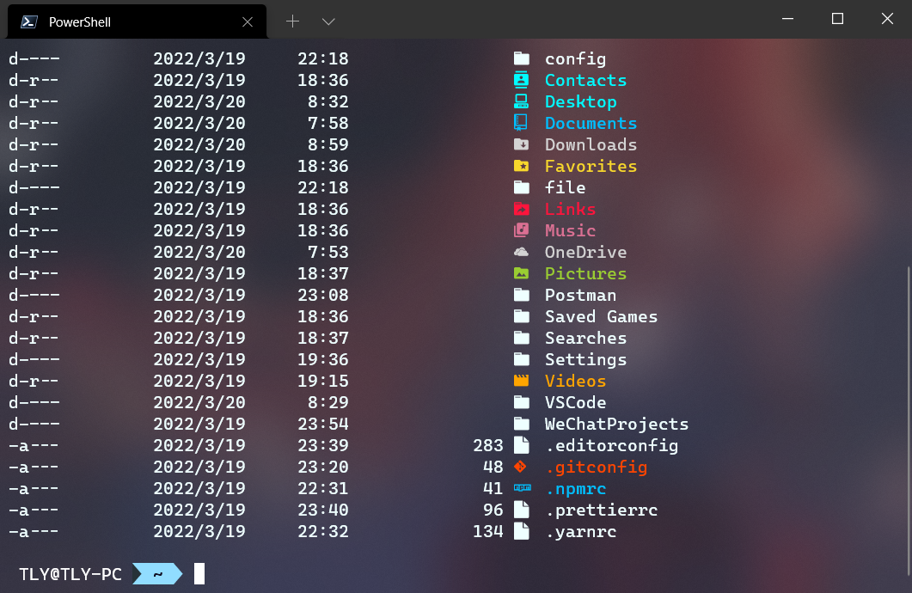

# PowerShell

需要使用**最新**的 PowerShell，配合 Windows Terminal 体验更佳。

::: tip 提示

Windows Terminal 可以从 Microsoft Store（微软商店）下载。

:::

## 安装和配置模块

### gsudo

gsudo 可以让你在 powershell 或其他 Windows 终端上使用 sudo 命令来提升权限。

::: tip 提示

这个不仅可用于 PowerShell

:::



#### 安装

```powershell
winget install gerardog.gsudo
```

### PSReadLine

这是我的 PSReadLine #### 配置

```powershell
Set-PSReadLineOption -PredictionSource History
Set-PSReadlineKeyHandler -Key Tab -Function MenuComplete
Set-PSReadLineKeyHandler -Chord "Ctrl+f" -Function ForwardWord
```

这能够使你的 powershell 提供历史记录的提示、类似 zsh 的菜单提示以及可以使用 Ctrl + f 来提示一个单词。



### posh-git

这是一个 git 的 powershell 库，能够提供一些 git 的提示。

#### 安装

```powershell
Install-Module posh-git -Scope CurrentUser
```

#### 配置

```powershell
Import-Module posh-git
```

### git-aliases

如果说只有 git 提示还不够，那还可以使用这个库。

这是一个类似于 ohmyzsh 的 git 插件。

#### 安装

```powershell
Install-Module git-aliases -Scope CurrentUser -AllowClobber
```

#### 配置

```powershell
Import-Module git-aliases -DisableNameChecking
```

我列举几个常用的命令：

| Alias | Command        |
| ----- | -------------- |
| g     | git            |
| ga    | git add        |
| gaa   | git add --all  |
| gb    | git branch     |
| gcmsg | git commit -m  |
| gl    | git pull       |
| gp    | git push       |
| gra   | git remote add |

### oh-my-posh

美化 powershell 的库。

::: warning 注意

需要使用 [nerd-fonts](https://github.com/ryanoasis/nerd-fonts) 字体，这里我推荐使用 [CascadiaCode](https://github.com/ryanoasis/nerd-fonts/releases/download/v2.1.0/CascadiaCode.zip) 的 CaskaydiaCove Nerd Font

:::

推荐使用我的版本和配置，效果图你已经看到过了！（从上往下看的话。🐶）

#### 安装

```powershell
winget install JanDeDobbeleer.OhMyPosh -s winget
```

#### 配置

```powershell
oh-my-posh init pwsh --config $env:POSH_THEMES_PATH\robbyrussel.omp.json | Invoke-Expression
```

### Terminal-Icons

一些文件图标。

::: warning 注意

需要使用 [nerd-fonts](https://github.com/ryanoasis/nerd-fonts) 字体，这里我推荐使用 [CascadiaCode](https://github.com/ryanoasis/nerd-fonts/releases/download/v2.1.0/CascadiaCode.zip) 的 CaskaydiaCove Nerd Font

:::



#### 安装

```powershell
Install-Module -Name Terminal-Icons -Repository PSGallery
```

#### 配置

```powershell
Import-Module -Name Terminal-Icons
```

### 一次性打包带走

#### 安装

```powershell
winget install gerardog.gsudo
Install-Module posh-git -Scope CurrentUser
Install-Module git-aliases -Scope CurrentUser -AllowClobber
winget install JanDeDobbeleer.OhMyPosh -s winget
Install-Module -Name Terminal-Icons -Repository PSGallery
```

#### 配置

```powershell
code $PROFILE
```

```powershell
Set-PSReadLineOption -PredictionSource History
Set-PSReadlineKeyHandler -Key Tab -Function MenuComplete
Set-PSReadLineKeyHandler -Chord "Ctrl+f" -Function ForwardWord
Import-Module posh-git
oh-my-posh init pwsh --config $env:POSH_THEMES_PATH\robbyrussel.omp.json | Invoke-Expression
Import-Module git-aliases -DisableNameChecking
Import-Module -Name Terminal-Icons
```

#### 其他

```powershell
Remove-Alias -Name ni -Force
Set-Alias -Name la -Value ls
```
